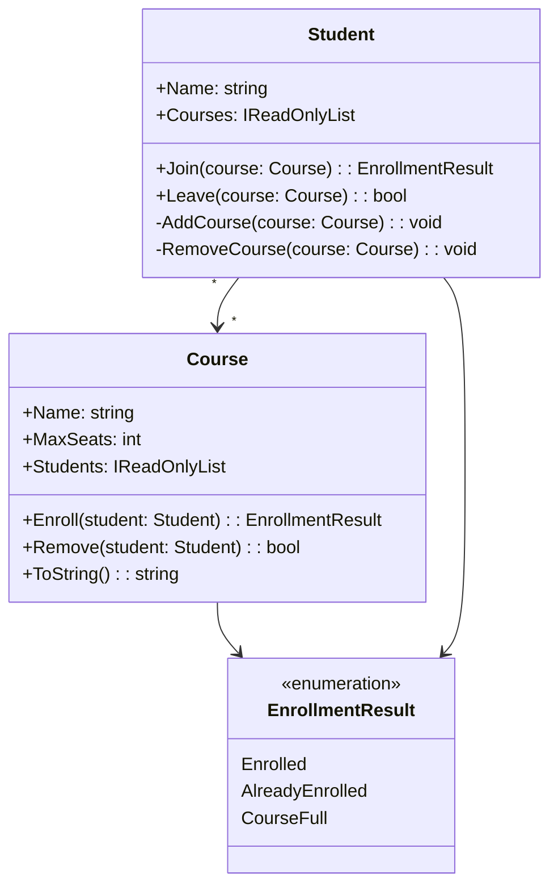

# UML Diagram - Education Project

## Class Name, Fields, Methods and Visibility

## Visibility Explanation

- `+` means public
- `-` means private
- Fields and methods with `+` can be accessed from outside the class
- Fields and methods with `-` are private and only used inside the class

## Student Class

- Name: `+Name: string`
- Courses: `+Courses: IReadOnlyList<Course>`
- Methods:
  - `+Join(course: Course): EnrollmentResult`
  - `+Leave(course: Course): bool`
  - `-AddCourse(course: Course): void`
  - `-RemoveCourse(course: Course): void`

## Course Class

- Name: `+Name: string`
- MaxSeats: `+MaxSeats: int`
- Students: `+Students: IReadOnlyList<Student>`
- Methods:
  - `+Enroll(student: Student): EnrollmentResult`
  - `+Remove(student: Student): bool`
  - `+ToString(): string`

## EnrollmentResult Enum

- `Enrolled`
- `AlreadyEnrolled`
- `CourseFull`

This enum is used to show the result of enrollment in a course.

## Description

The project contains two main classes: `Student` and `Course`. The `Student` class has a name and a list of courses. The `Course` class has a name, seat limit and a list of students. The methods `Join()` and `Enroll()` are used to register students, while `Leave()` and `Remove()` remove them. The visibility markers show which members are public and which are private. The relationship between `Student` and `Course` is many-to-many.