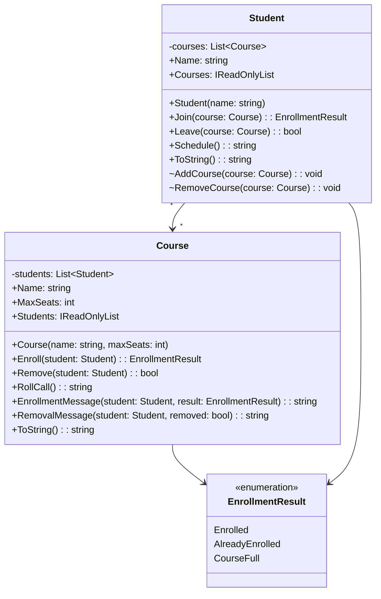

# UML Diagram - Education Project

## Class Name, Fields, Methods and Visibility

```mermaid
classDiagram
    class Student {
        -courses: List~Course~
        +Name: string
        +Courses: IReadOnlyList<Course>
        +Student(name: string)
        +Join(course: Course): EnrollmentResult
        +Leave(course: Course): bool
        +Schedule(): string
        +ToString(): string
        ~AddCourse(course: Course): void
        ~RemoveCourse(course: Course): void
    }

    class Course {
        -students: List~Student~
        +Name: string
        +MaxSeats: int
        +Students: IReadOnlyList<Student>
        +Course(name: string, maxSeats: int)
        +Enroll(student: Student): EnrollmentResult
        +Remove(student: Student): bool
        +RollCall(): string
        +EnrollmentMessage(student: Student, result: EnrollmentResult): string
        +RemovalMessage(student: Student, removed: bool): string
        +ToString(): string
    }

    class EnrollmentResult {
        <<enumeration>>
        Enrolled
        AlreadyEnrolled
        CourseFull
    }

    Student "*" --> "*" Course
    Course --> EnrollmentResult
    Student --> EnrollmentResult
```

## Visibility Explanation

- `+` means public
- `-` means private
- `~` means internal
- Fields and methods with `+` can be accessed from outside the class
- Fields and methods with `-` are private and only used inside the class
- Members marked `~` are available within the project/assembly

## Student Class

- Name: `+Name: string`
- Courses: `+Courses: IReadOnlyList<Course>`
- Private backing field: `-courses: List<Course>`
- Methods:
  - `+Join(course: Course): EnrollmentResult`
  - `+Leave(course: Course): bool`
  - `+Schedule(): string` returns a formatted schedule (or an empty-schedule message)
  - `+ToString(): string` returns the student's name
  - `~AddCourse(course: Course): void`
  - `~RemoveCourse(course: Course): void`

## Course Class

- Name: `+Name: string`
- MaxSeats: `+MaxSeats: int`
- Students: `+Students: IReadOnlyList<Student>`
- Private backing field: `-students: List<Student>`
- Methods:
  - `+Enroll(student: Student): EnrollmentResult`
  - `+Remove(student: Student): bool`
  - `+RollCall(): string` returns the course roster (or an empty-course message)
  - `+EnrollmentMessage(student: Student, result: EnrollmentResult): string` returns the enrollment outcome text
  - `+RemovalMessage(student: Student, removed: bool): string` returns the removal outcome text
  - `+ToString(): string`

## EnrollmentResult Enum

- `Enrolled`
- `AlreadyEnrolled`
- `CourseFull`

This enum is used to show the result of enrollment in a course.

## Description

The project contains two main classes: `Student` and `Course`. The `Student` class has a name and a private list of courses. The `Course` class has a name, a seat limit, and a private list of students. The methods `Join()` and `Enroll()` register students, while `Leave()` and `Remove()` remove them and keep both lists synchronized. `Schedule()` and `RollCall()` return formatted text for the student's courses and course roster. `EnrollmentMessage()` and `RemovalMessage()` return outcome text for `Program.cs` to display. The relationship between `Student` and `Course` is many-to-many.